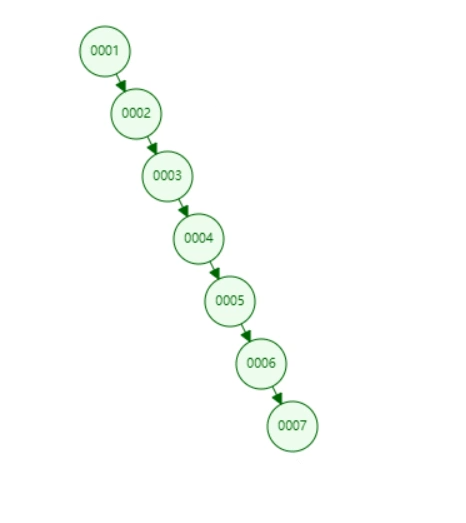
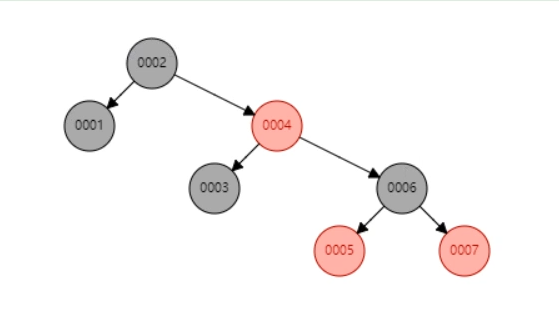
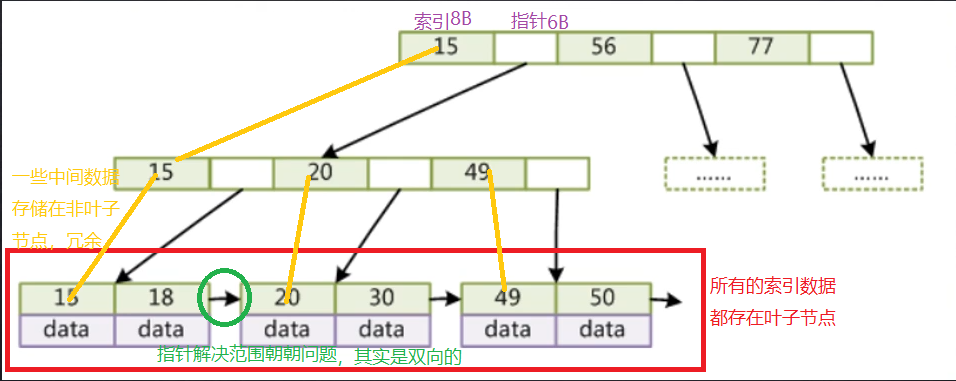
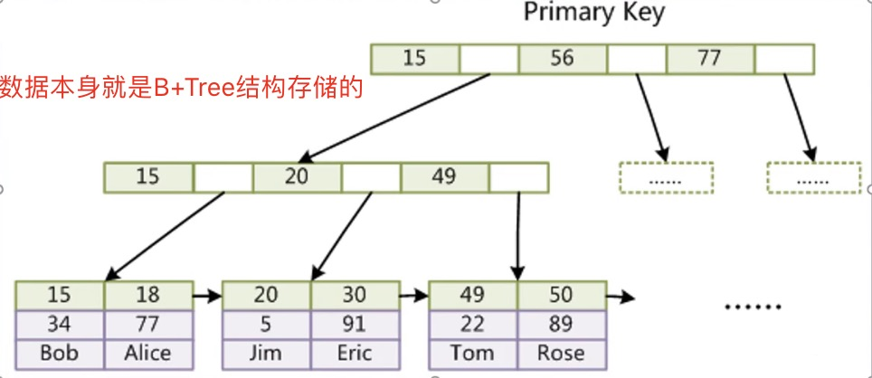
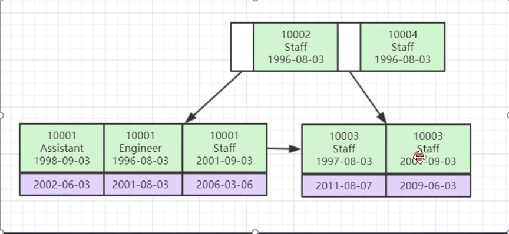

# 索引
> 索引是帮助MySQL高效获取数据的**排好序**的**数据结构**  

#### 索引数据结构
- 二叉树  
- 红黑树  
- Hash表  
- B-Tree  

##### 二叉树 ❌
有可能变成单边树  
导致毫无优化效果  

##### 红黑树 ❌
红黑树是一个弱平衡二叉树，有个自平衡的过程  
但是红黑树的高度是个问题，无法控制，导致查询次数多（每次都load一层的数据进RAM）  
  

##### Hash表
只需要一次io就可以确定记录  
用的很少，因为不适合范围查询  

##### B-Tree
- 叶节点具有相同的深度  
- 叶节点的指针为空  
- 节点中的数据索引从左到右递增排列  

##### B+Tree(B-Tree的变种)  
- 非叶子节点不存储data，只存储索引，可以放更多的索引，就有更多的分叉，就可以存储更多的索引元素  
- 叶子节点不存储指针  
- 顺序访问指针，提高区间访问的性能  
> mysql叶文件的大小默认是16K，也就是一个叶子节点能存储16条数据；在看非叶子节点，假设主键ID为bigint类型，那么长度是8B，指针大小在Innodb源码中为6B，一共就是14B，那么一页里就可以存储16K/ 14=1170个(主键+指针)    

##### 组织结构
1. MyISAM存储引擎  
一个表在文件系统中(windows)对应三个文件:  
- frm: 表的结构   
- myi: 表的索引  
- myd: 表的数据行  

如果一个查询命中索引，系统先去myi中查找这个条件对应的索引，然后索引对应的值就是数据磁盘中数据行的地址   

2. innoDB引擎  
一个表对应2个文件(windows)：  
- frm: 表结构  
- ibd: 数据和索引都存在这个文件里  
> ibd文件里的数据都是按B+Tree结构组织的，  
> 也就是把MyISAM叶子节点上的数据行指针直接换成了数据  

  

#### InnoDB索引实现  
- 表数据文件本身就是按照B+Tree组织的一个索引结构文件  
- **聚集索引**-叶子节点包含所有的数据记录，myisam就是**非聚集索引**  
- 为什么InnoDB表必须有主键，并且推荐使用整型的自增主键？  
> 如果没有，mysql会自己生成一个rowid之类的隐藏列  
> 整型：节省空间，比较运算速度快  
> 自增：新插入的数据可以直接放在树尾，速度快；否则会导致B+Tree的排序  
- 为什么非主键索引结构叶子节点存储的是主键值？(一致性和节省存储空间)  
>   
- 联合索引的底层数据结构长什么样？  
> 把每个字段做一个优先级大小排序，挨个比较  
>   

