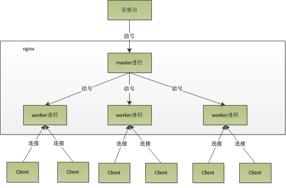

# Nginx从入门到精通
## nginx模块开发篇
### nginx性能高的原因
nginx运行后以daemon的方式在后台运行，一个master进程和多个worker进程(多进程的形式)，master进程主要用来管理worker进程。worker进程用来处理基本的网络事件，一般worker的个数与cpu的核数一致。  
  
我们所做的操作都是向master发出信号，然后master进程再向worker进程发出信号  

#### worker进程如何处理请求
每个worker进程都是从master进程fork过来，在master进程里先建立好需要listen的socket，多个worker进程的socket监控同一个IP地址与端口。当一个连接进来以后，所有accept这个socket的进程都会收到通知，但只有一个进程可以accept这个连接，其他的就会失败，这就是所谓的**惊群现象**
，nginx提供了accept_nutex(共享锁)来解决惊群问题  
> 当一个worker在accept这个连接后，就开始读取请求，解析请求，处理请求，产生数据后，返还给客户端，最后断开连接

#### nginx的异步非堵塞请求方式
一个请求的完整过程是：请求 -- 建立连接 -- 接受数据 -- 发送数据，具体到系统层面就是读写事件  
堵塞调用的话就是：事件没准备好，进入内核等待，CPU让出资源(加进程数量不合适，这和apache的线程模型有什么区别)  
非阻塞：事件没准备好，马上返回EAGAIN(Linux中常见的错误，提示再试一次？)，表明事件没准备好，等下再来检查事件，直到事件准备好为止，显然这样时不时回来检查增加了开销，nginx提供了异步非堵塞的事件处理机制：_具体到系统调用就像select/pll/epoll/kqueue这样，他们提供了一种机制，让你可以同时监控多个事件，调用它们是堵塞的，但是可以设置超时时间，在超时时间内，如果事件准备好了就返回_

 对于一个基本的web服务器来说，事件通常有三种类型，网络事件、信号、定时器  

 #### connection
 nginx中connection就是tcp连接的封装，其中包含连接的socket，读事件，写事件。nginx中http请求的处理就是建立在connection之上，所以nginx也可以用作邮件服务器

 #### nginx是如何处理一个连接的
 1. nginx在启动时会解析配置文件，得到需要监听的端口与IP地址   
 2. 在nginx的master进程里，先初始化好这个监控的socket(创建socket，设置addrreuse等选项，绑定到指定的IP地址端口，再listen)  
 3. fork出多个子进程出来，子进程会竞争accept新的连接  
 4. 客户端与nginx三次握手，建立好一个连接  
 5. 一个子进程会accept成功，得到这个建立好的连接的socket，然后创建nginx对连接的封装，即ngx_connection_t结构体  
 6. 设置读写事件处理函数，并添加读写事件来与客户端进行数据的交换  
 7. nginx或客户端主动关掉连接


#### request
在nginx中指的是http请求，具体到nginx中的数据结构是ngx_http_request_t(一个对http请求的封装)。
处理流程图


#### keepalive
长连接：http请求是请求应答式的，如果能知道每个请求头与响应体的长度，那么就可以在一个连接上面执行多个请求  
对于请求来说，如果当前请求需要有body(如POST)，那么nginx就需要客户端在请求头中指定content-length来表明body的大小，否则返回400。

#### pipe
pipline：流水线作业，可以看作是keep-alive的升级，pipline也是基于长连接的，目的是利用一个连接做多次请求。  
区别：  
- keepalive必须等到第一个请求的响应接受完全后才能发起第二个请求  
- pipline的话，客户端不必等到第一个请求处理完，就可以发起第二次请求

#### lingering_lose
延迟关闭：当nginx要关闭连接时，并不是立即关闭，而是先关闭tcp连接的写，再关闭连接的读  


### 基本数据结构
#### ngx_str_t(带长度的字符串结构)
长度而不是'\0'来表明一个字符串，这样在引用时，可以直接指向同一个内存地址，而不用copy一份，但是，修改的时候一定要谨慎   
常用API：
- ngx_string(str)  
通过一个以'\0'结尾的不同字符串str构造一个nginx的字符串  
- ngx_null_string  
初始化字符串   
- ngx_str_set(str, text)    
用于设置字符串str为text  
- ngx_str_null(str)  
设置字符串str为空
```nginx
ngx_str_t str = ngx_string("hello world");
ngx_str_t str1 = ngx_null_string;


ngx_str_t str, str1;
ngx_str_set(&str, "hello world");
ngx_str_null(&str1);
```

#### ngx_pool_t
一个管理一系列资源(内存，文件...)的机制，使得对这些资源的使用和释放统一进行  
如，我们需要使用内存，可以从一个ngx_pool_t的对象中获取内存，在最终，销毁这个ngx_pool_t对象，左右这些内存都被释放了  
```nginx
ngx_pool_t *ngx_create_pool(size_t size, ngx_log_t *log)
# 创建一个初始节点大小为size的pool，log为后续在该pool上进行操作时输出日志的对象，size的大小必须等于NGX_MAX_ALLOC_FROM_POOL，且必须大于sizeof(ngx_pool_t)  

void *ngx_palloc(ngx_pool_t *pool, size_t size);
# 从这个pool中分配一块为size大小的内存，此函数分配的内存的起始地址按照NGX_ALIGNMENT进行了对其

void *ngx_pnalloc(ng_pool_t *pool, size_t size);
# 从这个pool中分配一块大小为size的内存，但是此函数分配的内存并没有像上面的函数那样对齐  

void *ng_pcalloc(ngx_pool_t *pool, size_t size);
# 分配了size大小的内存，并对分配的内存进行了清零

void *ngx_pmemalign(ngx_pool_t *pool, size_t size, size_t alignment);
# 按照指定对齐大小alignment来申请一块大小为size的内存

etc...
```

#### ngx_array_t
是ngin内部使用的数组结构  
```
ngx_array_t *ngx_array_create(ngx_pool_t *p, ngx_uint_t n, size_t size);
# 创建一个新的数组对象，并返回这个对象
# p 数组分配内存使用的内存池
# n 数组的初始容量大小
# size 单个元素的大小，字节

void ngx_array_destroy(ngx_array_t *a);
# 销毁该数组对象

void *ngx_array_push(ngx_array_t *a);
# 在数组a上新追加一个元素，并返回指向新元素的指针

...
```

#### ngx_hash_t
```nginx
ngx_int_t ngx_hash_init(ngx_hash_init_t *hinit, ngx_hash_key_t *names,
ngx_uint_t nelts);
# 初始化
...
```
#### ngx_hash_combined_t
组合类型hash表，提供一个方便的容易包含三个类型的hash表，当有包含通配符和不包含通配符的一组key构建你hash表后，以一种方便的方式来查询，不需要考虑一个key到底应该去哪个类型的hash表里查
```nginx
void *ngx_hash_find_combined(ngx_hash_combined_t *hash, ngx_uint_t key,
u_char *name, size_t len);
```
#### ngx_hash_keys_arrays_t
#### ngx_chain_t
#### ngx_buf_t
ngx_chain_t链表的每个节点的实际数据  
#### ngx_list_t
类似一个list的数据结构，有list的一些特点(添加元素，自增长，内部实现使用链表)，不同在于它的节点，不像普通的list，一个节点只能存放一个元素，ngx_list_t的节点实际上是一个固定大小的数组  
#### ngx_queue_t
nginx中的双向链表

### nginx的配置系统
nginx的配置系统由一个主配置文件和其他一些辅助的配置文件构成，全部位于nginx安装目录下的conf目录下  
主配置文件nginx.conf以外的文件都是在某些情况下才使用的  
nginx.conf中，包含若干配置项，每个配置项由指令和指令参数构成  
#### 指令概述
配置指令是一个字符串，可以用单、双引号括起来，也可以不括，但是如果有空格，一定需要  
#### 指令参数
- 指令的参数使用一个或多个空格或者TAB字符与指令分开。指令参数由一个或多个TOKEN串组成，TOEKN之间由空格或TAB分隔  
- TOKEN串分配简单字符串或者是复合配置块。复合配置块由大括号括起来的一堆内容，一个复合配置块中可能包含若干其他的配置指令  
- 指定参数只有字符串 --> 简单配置项，否则就是复杂配置项  
```nginx
error_page 500 502 503 504 /50x.html;
# 简单配置项
# 分号结尾

location / {
  root /home/ngin-book/build/html;
  index index.html index.htm;
}
# 复杂配置项
```

#### 指令上下文
- main: nginx在运行时与具体业务功能(如http服务或者email服务代理)无关的一些参数。比如工作进程数，运行的身份等  
- http: 提供http服务相关的一些配置参数。比如是否使用keepalive，是否使用gzip进行压缩等  
- server: http服务上支持若干虚拟主机。每个虚拟主机对应的server配置项，配置项里面包含该虚拟主机相关的配置  
- location: http服务中，某些特定的URL对应的一系列配置项  
- mail: 实现email相关的  
> 指令上下文可能有包含的情况出现：通常http上下文和mail上下文一定是出现在main上下文里，可能包含另一种类型的上下文多次，如：如果http服务，支持多个虚拟机，那么http上下文里就会出现多个server上下文  
```nginx
user nobody;
worker_processes 1;
error_log logs/error.log info;

events {
  worker_connection 1024;
}

http {
  server {
      listen       80;
      server_name  www.linuxdic.com;
      access_log   logs/linuxidc.com/htdocs;
      location / {
        index index.html;
        root  /var/www/linuxidc.com/htdocs;
      }
  }

  server {
      listen       80;
      server_name  www.Androidj.com;
      access_lg    logs/anrroidj.access.log main;
      location / {
        index index.html;
        root /var/www/androidj.com/htdocs;
      }
  }
}
```

#### nginx的模块化体系结构
nginx的核心是由核心部分和一系列的功能模块所组成。  
nginx提供了web服务器的基础功能，同时提供了web服务反向代理，email服务反向代理功能。ngxin core(nginx核心功能)实现了底层的通讯协议，为其他模块和nginx进程构建了基本的运行时环境，并且构建了其他各模块的协作基础。除此之外，大部分与协议相关的，或者应用相关的功能都在这些模块中实现  

#### 模块概述
nginx将各个功能模块组织成一条链，当有请求到达的时候，请求一次经过这条链上的部分或者全部模块，进行处理。每个模块实现特定的功能。  
http和mail模块比较特殊，它们在nginx core上实现了另一层抽象，处理与HTTP和email相关的协议(SMPT/POP3/IMAP)相关的事件，并且确保这些时间能被以正确的顺序调用其他的一些功能模块    

#### 模块的分类
- event  搭建了独立于操作系统的事件处理机制的框架，及提供了各种具体时间的处理，包括ngx_events_module  
- module ngx_event_core_module和ngx_epoll_module  
- phase  次类型的模块被成为handler模块，主要负责处理客户端请求并产生待响应内容  
- handler ngx_http_static_module模块，负责客户端的静态页面请求处理并将对应的磁盘文件准备为响应内容输出  
- output 也称filter模块，主要负责对输出的内容进行处理  
- filter html页面增加预定义的footbar一类的工作，或者对输出的图片的URL进行替换之类的  
- upstream 实现反射代理的功能，将真正的请求转发到后端的服务器上，并从后端读取响应，发回客户端，upstream模块是一种特殊的handler，只不过响应内容不是真正由自己产生的，而是从后端服务器上读取的  
- load-bakancer  负载均衡模块，实现特定的算法，在众多的后端服务中，选择一个服务器出来作为某个请求的转发服务器

#### nginx的请求处理
nginx使用一个多进程模型来对外提供服务，其中一个master进程，多个worker进程。master进程负责管理nginx本身和其他worker进程   
所有实际上的业务处理逻辑都在worker进程。worker进程中有一个函数，执行无限循环，不断处理收到的来自客户端的请求，并进行处理，直到整个nginx服务器被停止  
worker进程中，ngx_worker_process_cycle()函数就是这个无限循环函数，在这个函数中，一个请求的简单处理流程如下：  
1. 操作系统提供的机智(如epoll, kqueue等)产生相关的事件  
2. 接收和处理这些事件，如是接收到数据，则产生更高层的request对象  
3. 处理request的header和body  
4. 产生响应，并发回客户端  
5. 完成request请求   
6. 重新初始化定时器及其他事件  

#### 请求的处理流程
一个HTTP Requst的处理流程如下：  
1. 初始化HTTP Requst(读取来自客户端的数据，生成HTTP Requst对象，该对象包含有改请求所有的信息)  
2. 处理请求头  
3. 处理请求体  
4. 如果有的话，调用此请求(URL或者Location)关联的handler  
5. 依次调用各phase handler(包含若干个处理阶段的一些handler)进行处理  
